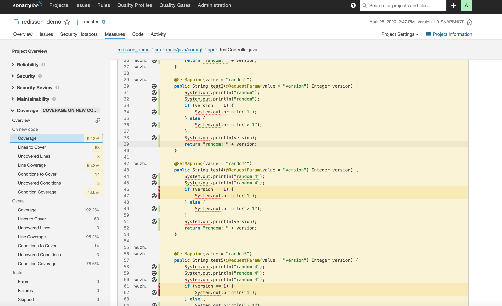

# JacocoCollector

增量覆盖率Jacoco收集器

### 实现功能

---

1. 增量代码检查
2. 历史覆盖率合并
3. 以函数body为单元判定新增状态，函数调整位置会导致它被判为新增代码

### 使用步骤

---

1. 以 java -javaagent=jacocoagent.jar yourjar.jar 方式启动业务服务
2. 注册业务服务信息到 JacocoCollector 服务上
3. 测试人员通过点击 UI 界面进行测试
4. 在 SonarQube 上可以看到 测试分支 在 生产分支下引入的新代码的测试覆盖率

