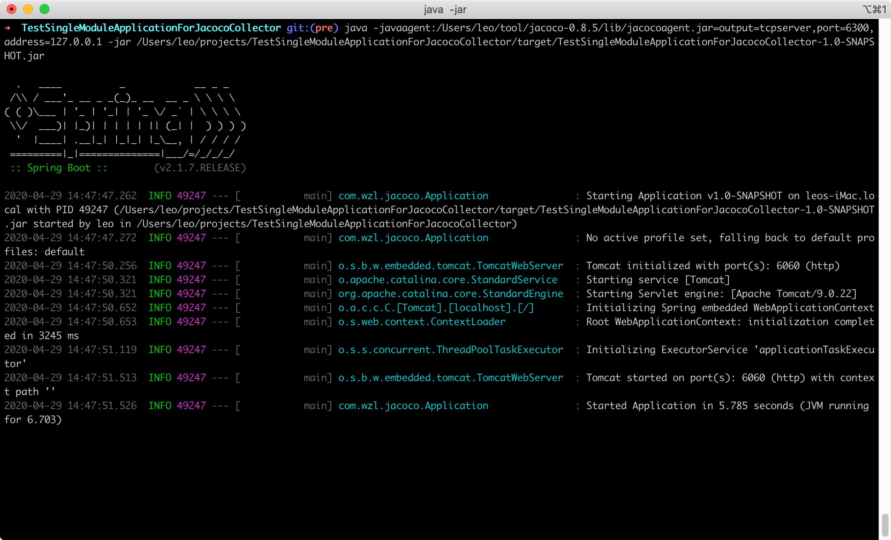

# JacocoCollector

增量覆盖率Jacoco收集器

### 系统架构

---



### 实现功能

---

1. 增量代码检查
2. 历史覆盖率合并
3. 以函数body为单元判定新增状态，函数调整位置、增加注释、格式化代码都不会导致它被判为新增代码

### 食用指南

---

1. 以 java -javaagent=jacocoagent.jar yourjar.jar 方式启动业务服务
2. 注册业务服务信息到 JacocoCollector 服务上
3. 测试人员通过点击 UI 界面进行测试
4. 在 SonarQube 上可以看到 测试分支 在 生产分支下引入的新代码的测试覆盖率

### 测试过程

---

1、启动SonarQube， 详情查看官方文档

---

2、启动JacocoCollector服务

---

3、创建图书馆项目，实现基本的逻辑，推送master（正式分支）， 然后checkout -b pre（测试分支）。

```bash
git clone [https://github.com/wuzhenglin510/TestSingleModuleApplicationForJacocoCollector.git](https://github.com/wuzhenglin510/TestSingleModuleApplicationForJacocoCollector.git)
```

---

4、通过 java -javaagent=jacocoagent.jar启动项目

```bash
java -javaagent:/Users/leo/tool/jacoco-0.8.5/lib/jacocoagent.jar=output=tcpserver,port=6300,address=127.0.0.1 -jar /Users/leo/projects/TestSingleModuleApplicationForreadme/target/TestSingleModuleApplicationForJacocoCollector-1.0-SNAPSHOT.jar
```


---

5、业务项目起来后， 通过post请求，将业务服务的信息注册到JacocoCollector服务


---

6、注册成功后， JacocoCollector开始定时向业务服务拉取Jacoco打桩后的运行时数据,  并且拉取最新的项目代码编译， 生成覆盖率 xml文件。并通过 mvn sonar:sonar推送到SonarQube


---

7、打开SonarQube界面， 发现当前的覆盖率几乎是100%的，这是因为JacocoCollector的目的是做增量代码覆盖率， 因为上面我们的 pre 分支对比 master没有任何改变，所以所有都将被判定为已完成测试，并不考虑以前的老代码的真实覆盖率。让测试人员可以抛弃以前的包袱，专心当前版本引入的新功能。


---

8、这时候我们检查一下单纯调整代码排版（增加 //  /**/ 注释、增加空白行、格式化代码、插入空格、给函数们上下换个位置等），理论上我们应该看到的覆盖率还是100%，因为函数体并没有什么实质性的改变

原代码。从下图中可以看到， 的确是做到这样的功能。


---

9、如果我们修改了一个方法，这时候我们是需要清除这个方法的覆盖率的，可以看到我们分别在两个函数中加了两行log，所以这两个方法需要清除历史覆盖率。而其他没有改动过的代码不需要清除，所以依旧是 100%的测试，因为合并了上一次的覆盖率文件。


---

10、我们现在模拟测试人员点击 UI 或自动化接口测试，对后端发起请求。等JacocoCollector定时轮训处理这个项目的时候， 就会将下面跑过的代码进行标注。


继续请求get_book接口


11、至此完成测试